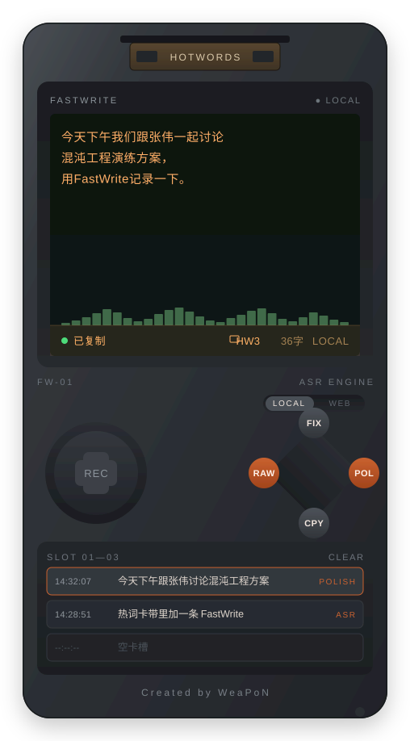

# FastWrite · 语音速记（掌机版）

**说一段，写一段。** 一台复古掌机形态的本地语音速记工具：对着它口述，屏幕实时变字，停下自动落定并复制，直接粘贴进文档。识别本地优先、热词可定制、AI 辅助纠错/润色，双击即用。

<p align="center">
  
</p>

<p align="center">
  <a href="https://weapon-wpn.github.io/FastWrite/Handheld-prototype.html">→ 在线预览可交互原型</a>
</p>

## 特性

- **本地识别，隐私可控** — 基于 [FunASR](https://github.com/modelscope/FunASR) `paraformer-zh-streaming` 流式引擎 + VAD 自动分段 + 标点恢复，音频默认不出本机。
- **热词定制** — 卡带背面维护人名、术语、项目名，识别请求实时携带，立即生效。
- **AI 辅助（按键式）** — 菱形键 `FIX` 纠错 / `POL` 润色，均以原始识别文本为输入，避免多次处理后的叠加劣化；结果自动复制并覆盖历史。
- **零依赖兜底** — 无 Python 环境时自动降级浏览器 `Web Speech API`，功能不中断（无热词/AI 能力）。
- **掌机质感界面** — 暗绿屏 + 琥珀字、扫描线、真实麦克风波形、十字录制键、卡带翻面、SLOT 01–03 会话历史，纯 HTML/CSS/JS 单文件前端。

## 快速开始

```
双击 FastWrite-Launcher.bat
```

- 首次运行会自动创建虚拟环境并安装依赖（含 PyTorch，需要联网，耗时数分钟）；FunASR 模型首次加载约 10–60 秒。
- 启动完成后浏览器自动打开 `http://localhost:8964/`。
- 无可用 Python 环境时，启动器会退化为纯静态服务（`FastWrite-Server.ps1`），前端自动切换到浏览器语音识别兜底。
- 端口 `8964` 被占用时：若是 FastWrite 自己已在运行，启动器会直接打开浏览器；若被其他程序占用，会提示需要先释放端口。

## 配置 AI 纠错 / 润色（可选）

FIX / POL 依赖一个 OpenAI 兼容的 LLM 接口（默认 DeepSeek）。不配置也完全不影响录音与识别，仅 FIX/POL 会静默跳过。

```
copy server\config.example.json server\config.json
```

编辑 `server/config.json` 填入你的 `api_key`：

```json
{
  "provider": "deepseek",
  "base_url": "https://api.deepseek.com",
  "api_key": "sk-...",
  "model": "deepseek-v4-flash",
  "timeout": 10
}
```

> `server/config.json` 已在 `.gitignore` 中，API Key 仅存本机后端，不会被提交、也不会发送给前端。

## 项目结构

```
FastWrite/
├─ Handheld.html              # 前端：掌机界面，单文件 HTML/CSS/JS
├─ FastWrite-Launcher.bat     # 启动器：拉起本地后端，无 Python 时降级
├─ FastWrite-Server.ps1       # 兜底静态服务器（无 Python 环境时）
├─ server/
│  ├─ main.py                 # FastAPI：静态服务 + WS 流式识别 + 热词/LLM 接口
│  ├─ asr_engine.py           # FunASR 封装：流式 ASR + VAD 分段 + 标点恢复
│  ├─ llm_proxy.py            # LLM 代理：纠错 / 润色（OpenAI 兼容协议）
│  ├─ config.example.json     # LLM 配置模板（config.json 需自行创建，勿提交）
│  ├─ hotwords.json           # 本地热词表（运行时生成，勿提交）
│  └─ test_ws.py              # WS /ws/asr 端到端冒烟测试脚本
├─ PRD.md                     # 产品需求文档
└─ 掌机原型说明.md              # 掌机 UI 原型的功能与交互说明
```

## 技术栈

| 层 | 选型 |
|---|---|
| 前端 | 原生 HTML / CSS / JS（无框架），单文件交付 |
| 后端 | FastAPI + Uvicorn（WebSocket 流式） |
| 语音识别 | FunASR：`paraformer-zh-streaming`（流式 ASR）+ `fsmn-vad`（分段）+ `ct-punc`（标点） |
| AI 纠错/润色 | OpenAI 兼容接口（DeepSeek 默认，可换 OpenAI / 本地 Ollama） |
| 兜底识别 | 浏览器 `Web Speech API` |

## 核心接口

| 接口 | 说明 |
|---|---|
| `GET /health` | 探测本地引擎是否可达、模型是否加载完成、LLM 是否已配置 |
| `WS /ws/asr` | 流式上传 16k/16bit/mono PCM，返回 `interim` / `final` / `done` |
| `GET/POST /hotwords` | 读取/保存热词表 |
| `POST /rewrite` | LLM 纠错（`correct`）/ 润色（`polish`） |

## 已知限制

- 仅支持中文识别（本地引擎不支持中英混合/多语言）。
- 会话内历史（SLOT 01–03）不持久化，刷新页面即清空。
- 屏幕文字只读，不提供屏内编辑。
- 当前仅验证 Windows 10/11 + Chrome/Edge。

## Roadmap

- [x] 掌机视觉与交互（机身/屏幕/翻面/卡带/按键/真实波形）
- [x] 本地识别后端（FunASR 流式 + VAD + 热词）
- [x] LLM 纠错/润色代理
- [ ] 前端工程化（模块化源码 + 单文件构建）
- [ ] 全链路验收打磨（异常路径、启动器体验）

## License

[MIT](LICENSE) © Wang Peinan

---

<p align="center"><sub>Created by WeaPoN</sub></p>
